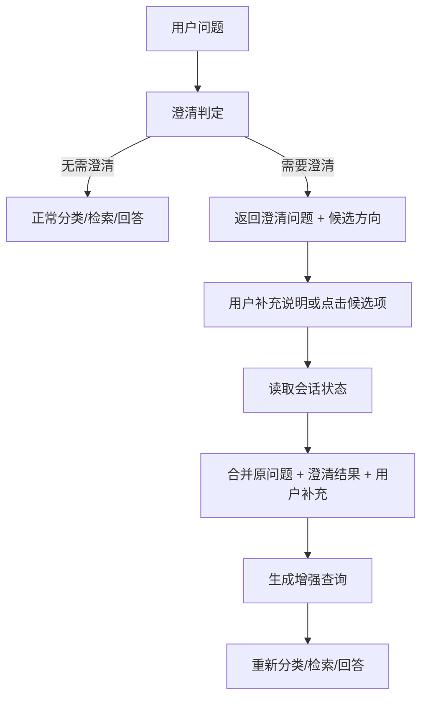
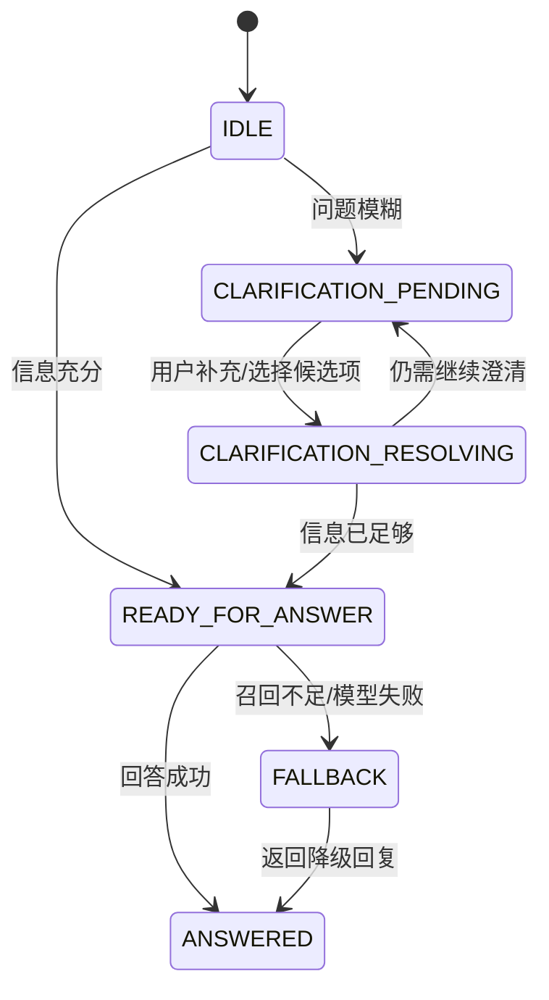

# TraceMind 多轮澄清闭环设计

## 1. 文档目标

本文档用于指导 TraceMind 将当前“单次澄清提示”升级为“真正可闭环的多轮澄清机制”。

目标不是简单多问一句，而是让系统能够：

1. 识别哪些问题必须先澄清。
2. 输出低成本、可操作的澄清问题。
3. 在用户补充后消费补充信息，而不是把补充当成全新问题。
4. 将澄清结果沉淀为结构化会话状态。
5. 让前端、API、路由、检索、回答形成完整闭环。

---

## 2. 当前现状与问题

当前仓库已经有第一版澄清能力：

- [tracemind/clarifier.py](D:/找实习/TraceMind/tracemind/clarifier.py)
- [tracemind/pipeline.py](D:/找实习/TraceMind/tracemind/pipeline.py)

当前行为是：

1. `pipeline_result()` 先调用 `clarify_query()`
2. 如果判断需要澄清，直接返回：
   - `response_type = clarification`
   - `candidate_intents`
   - 一段澄清提示文案
3. 如果不需要澄清，进入正常问答链路

这已经能挡住一部分模糊问题，但仍有三个核心缺口：

1. **没有会话状态**
   用户补充的信息没有地方存，也不会影响后续链路。

2. **没有澄清后的重新理解**
   第二轮补充不会和第一轮原始问题合并成增强查询。

3. **没有真正的交互闭环**
   前端只能展示澄清结果，不能把用户点击的候选方向和追加描述送回后端继续处理。

换句话说，当前系统有“澄清入口”，但没有“澄清完成后的推进能力”。

---

## 3. 设计目标

### 3.1 核心目标

实现一个最小但完整的多轮澄清闭环，使系统具备以下能力：

1. 对模糊问题触发澄清。
2. 生成结构化澄清结果。
3. 记录会话状态。
4. 用户补充后，基于“原问题 + 澄清信息 + 新补充”生成增强查询。
5. 增强查询进入正常的分类、检索、回答链路。

### 3.2 非目标

本阶段先不做：

1. 长期复杂 memory。
2. 跨天会话持久化。
3. 多轮自由对话总结。
4. 极复杂的槽位推理框架。
5. 完整工单系统或人工客服接管。

本阶段追求的是“客服问答场景下够用、可解释、可迭代”的闭环机制。

---

## 4. 闭环设计总览

## 4.1 逻辑总流程



## 4.2 核心原则

1. 澄清的输出必须结构化，不只是文本。
2. 澄清之后的下一轮必须读取会话状态。
3. 增强查询必须作为后续链路的真正输入。
4. 前端必须能显式感知“当前处于澄清中”。
5. 每一步都要有可观测日志。

---

## 5. 问题一：什么情况下必须澄清

## 5.1 触发目标

不是所有问题都该澄清。只有在“直接进入检索和回答会显著降低正确率”时才应该触发。

## 5.2 需要澄清的典型场景

### A. 产品对象不明确

例子：

- “这个功能怎么不好用”
- “这个页面报错了”
- “这个型号不行”

缺失信息：

- 哪个产品
- 哪个页面
- 哪个功能

### B. 任务目标不明确

例子：

- “这个怎么设置”
- “这个怎么弄”
- “怎么操作”

缺失信息：

- 想完成什么动作
- 当前在哪个页面或步骤

### C. 故障现象不明确

例子：

- “不能用”
- “开不了”
- “失败了”

缺失信息：

- 完全无法启动
- 启动后报错
- 某一步失败
- 有无报错文案/截图

### D. 候选意图过多

例子：

- “售后怎么处理”
- “这个订单有问题”

可能同时涉及：

- 退款
- 换货
- 维修
- 投诉
- 发票

### E. 检索证据不足

即使用户问题表面完整，但如果：

- 路由候选分散
- 召回结果分数低
- top chunks 来源冲突

也应在进入最终回答前触发一次补充。

## 5.3 触发信号设计

澄清判定不能只靠 LLM，建议采用“规则 + 统计信号 + LLM 判断”的组合策略。

### 第一层：规则信号

由 [tracemind/clarifier.py](D:/找实习/TraceMind/tracemind/clarifier.py) 负责：

1. 模糊表达正则命中
2. 长度过短
3. 指代词过多，如“这个”“它”“那个页面”
4. 缺少产品名、功能名、报错现象

### 第二层：链路信号

后续新增，建议来自：

1. 分类置信度低
2. 候选 source 数过多
3. 检索 top-k 分数整体偏低
4. top chunks 来自多个不相关 source
5. 首答为“信息不足”或“无法判断”

### 第三层：LLM 结构化判断

LLM 只做最后的语义补充，不做唯一判定源。

## 5.4 判定接口建议

新增统一判定结果：

```json
{
  "need_clarification": true,
  "trigger_signals": [
    "vague_pattern",
    "missing_product",
    "low_retrieval_confidence"
  ],
  "missing_slots": [
    "product_name",
    "task_type",
    "error_symptom"
  ],
  "clarification_priority": "high"
}
```

---

## 6. 问题二：澄清时到底该问什么

## 6.1 设计原则

澄清问题必须满足四个要求：

1. **低成本**
   用户一眼就知道怎么补。

2. **强约束**
   尽量引导用户补最关键的信息。

3. **短文本**
   一次只追一个关键缺口。

4. **可结构化消费**
   候选项可以直接映射到槽位。

## 6.2 澄清输出结构

建议把澄清响应标准化为：

```json
{
  "response_type": "clarification",
  "clarification_state": "pending",
  "clarification_question": "你想咨询的是哪一类问题？",
  "candidate_intents": [
    {
      "id": "task_installation",
      "label": "安装/配网",
      "slot_key": "task_type",
      "slot_value": "installation"
    },
    {
      "id": "task_feature_usage",
      "label": "功能使用",
      "slot_key": "task_type",
      "slot_value": "feature_usage"
    },
    {
      "id": "task_fault",
      "label": "故障报错",
      "slot_key": "task_type",
      "slot_value": "fault"
    }
  ],
  "missing_slots": [
    "task_type"
  ]
}
```

这里的关键变化是：

- `candidate_intents` 不再只是字符串
- 每个候选项都可以直接写入会话槽位

## 6.3 澄清问题模板类型

### 类型 A：候选意图型

适用于：

- 问题主题过大
- 有多个高频客服方向

示例：

- “你想咨询的是哪一类问题？”

候选项：

- 安装/配网
- 功能设置
- 故障报错
- 售后维修

### 类型 B：缺失槽位型

适用于：

- 已知道大方向
- 只缺一个关键字段

示例：

- “你说的‘开不了’更接近哪种情况？”

候选项：

- 完全无法开机
- 能开机但报错
- 运行中自动关闭

### 类型 C：混合型

适用于：

- 问题很模糊
- 同时缺产品和现象

示例：

- “可以补充一下是哪个产品，以及具体出现了什么现象吗？”

这类问题必须附带候选方向，避免纯开放式追问。

## 6.4 候选项生成原则

候选项建议满足：

1. 2 到 4 个即可
2. 标签短，不超过 8 到 12 个汉字
3. 贴近客服语言，不用内部术语
4. 能映射为结构化槽位

不建议：

- “请提供更多上下文”
- “请详细说明”

建议：

- “哪个产品或型号”
- “想完成什么操作”
- “出现了什么报错”

---

## 7. 问题三：用户补充后，系统怎么接上

这是整个闭环最关键的一步。

## 7.1 基本要求

用户第二轮输入不能被当成一个孤立 query。

后端必须把以下信息合并：

1. 原始问题
2. 系统上一轮的澄清上下文
3. 用户点击的候选项
4. 用户本轮补充文本

然后生成增强查询，再进入主链路。

## 7.2 增强查询生成机制

建议新增一个 `query_rewriter` 或 `clarification_resolver` 节点。

输入：

```json
{
  "original_query": "这个功能不好用",
  "selected_intent": {
    "slot_key": "task_type",
    "slot_value": "fault"
  },
  "user_followup": "点击以后没有反应",
  "slots": {
    "task_type": "fault",
    "product_name": null,
    "error_symptom": "点击以后没有反应"
  }
}
```

输出：

```json
{
  "resolved": true,
  "enhanced_query": "用户咨询某产品功能异常，属于故障问题，当前现象是点击以后没有反应。原始问题：这个功能不好用。",
  "remaining_missing_slots": [
    "product_name"
  ]
}
```

## 7.3 进入主链路前的判断

增强查询生成后，不一定立刻进入正式问答。需要再判断一次：

1. 关键槽位是否已足够
2. 是否还缺产品对象
3. 是否还需要继续澄清

因此建议状态流转为：

1. `pending`
2. `resolving`
3. `resolved`
4. `need_more_clarification`

## 7.4 第二次澄清策略

如果第一次补充后仍不够：

- 允许第二次澄清
- 但最多 2 轮

超过 2 轮仍不充分，建议降级为：

1. 返回保守建议
2. 要求上传更具体截图/报错
3. 提示转人工

避免无限追问。

---

## 8. 问题四：会话里到底要存什么

## 8.1 最小会话状态

建议先实现内存态会话存储，结构如下：

```json
{
  "session_id": "kf_xxx",
  "status": "clarification_pending",
  "turn_count": 1,
  "original_query": "这个功能不好用",
  "current_query": "这个功能不好用",
  "clarification_round": 1,
  "missing_slots": [
    "task_type",
    "error_symptom"
  ],
  "slots": {
    "product_name": null,
    "product_model": null,
    "task_type": null,
    "page_name": null,
    "feature_name": null,
    "error_symptom": null,
    "error_message": null
  },
  "candidate_intents": [
    {
      "id": "task_fault",
      "label": "故障报错",
      "slot_key": "task_type",
      "slot_value": "fault"
    }
  ],
  "selected_intent": null,
  "history": [
    {
      "role": "user",
      "content": "这个功能不好用"
    },
    {
      "role": "assistant",
      "content": "你想咨询的是哪一类问题？"
    }
  ]
}
```

## 8.2 必存字段

### A. 查询字段

- `original_query`
- `current_query`
- `turn_count`

### B. 澄清字段

- `clarification_round`
- `missing_slots`
- `candidate_intents`
- `selected_intent`

### C. 结构化槽位

建议第一版就定义这些：

- `product_name`
- `product_model`
- `task_type`
- `page_name`
- `feature_name`
- `error_symptom`
- `error_message`

### D. 会话历史

先保留最近 6 到 10 条即可，不要无限积累。

## 8.3 存储方案

第一版建议：

1. 进程内内存字典
2. 按 `session_id` 读写
3. 设置 TTL，例如 30 分钟

后续再升级为：

- Redis
- 数据库存档

## 8.4 代码落点建议

新增：

- `tracemind/session_store.py`

核心接口：

```python
def get_session(session_id: str) -> ConversationState | None: ...
def save_session(session_id: str, state: ConversationState) -> None: ...
def clear_session(session_id: str) -> None: ...
```

---

## 9. 问题五：前端交互怎么配合

没有前端配合，后端的澄清闭环只能完成一半。

## 9.1 前端必须支持的能力

当前测试页需要补充：

1. 明确展示 `response_type`
2. 当 `response_type=clarification` 时渲染候选按钮
3. 记住 `session_id`
4. 用户点击候选项后自动回填
5. 用户可继续手动补充
6. 同一会话内继续发送请求

## 9.2 交互流程建议

### 场景一：用户点击候选项

1. 用户提问：“这个功能不好用”
2. 后端返回澄清结果
3. 前端展示按钮：
   - 安装/配网
   - 功能设置
   - 故障报错
4. 用户点击“故障报错”
5. 前端发送：
   - `session_id`
   - `clarification_selection`
   - 可选补充文本

### 场景二：用户自由补充

1. 用户看到澄清问题
2. 直接输入：“点击之后没有反应”
3. 前端发送相同 `session_id`
4. 后端将这段文本作为澄清补充，而不是独立新问题

## 9.3 前端请求结构建议

现有 `/chat` 可以扩展，而不必新开接口。

请求体建议扩展为：

```json
{
  "question": "点击之后没有反应",
  "session_id": "kf_xxx",
  "stream": false,
  "clarification": {
    "is_followup": true,
    "selected_intent_id": "task_fault"
  }
}
```

新增字段说明：

- `clarification.is_followup`
  表示当前输入是对上一轮澄清的补充

- `clarification.selected_intent_id`
  表示用户点击了哪一个候选项

## 9.4 前端状态展示建议

前端建议区分三种消息：

1. `answer`
2. `clarification`
3. `fallback`

这样用户能明确感知系统现在处于：

- 正式回答
- 补充信息
- 暂时无法充分回答

---

## 10. 状态机设计

## 10.1 状态定义

建议新增如下状态：

```text
IDLE
CLARIFICATION_PENDING
CLARIFICATION_RESOLVING
READY_FOR_ANSWER
ANSWERED
FALLBACK
```

## 10.2 状态流转



## 10.3 状态机约束

1. 每次澄清轮数最多 2 次
2. `ANSWERED` 后默认清空澄清状态，但保留基础历史
3. 如果用户开启一个明显新话题，可以重置状态

---

## 11. API 设计建议

## 11.1 请求体扩展

建议修改 [tracemind/api.py](D:/找实习/TraceMind/tracemind/api.py) 中的 `ChatRequestBody`：

```python
class ClarificationPayload(BaseModel):
    is_followup: bool = False
    selected_intent_id: str | None = None


class ChatRequestBody(BaseModel):
    question: str
    session_id: str | None = None
    images: list[str] = []
    stream: bool = False
    clarification: ClarificationPayload | None = None
```

## 11.2 响应体扩展

建议扩展 `ChatResponseData`：

```python
class CandidateIntent(BaseModel):
    id: str
    label: str


class ChatResponseData(BaseModel):
    answer: str
    session_id: str
    timestamp: str
    response_type: Literal["answer", "clarification", "fallback"]
    clarification_state: Literal["none", "pending", "resolved"] = "none"
    candidate_intents: list[CandidateIntent] = []
    missing_slots: list[str] = []
```

## 11.3 行为规则

### 普通请求

如果 `clarification` 为空：

- 按首轮问题处理

### 澄清补充请求

如果 `clarification.is_followup=true`：

- 读取 `session_id`
- 拉取当前会话状态
- 合并补充信息
- 尝试生成增强查询
- 决定继续澄清还是进入正式问答

---

## 12. 后端模块拆分建议

建议把闭环拆成以下模块，而不是全堆在 `pipeline.py`：

### 12.1 `clarifier.py`

职责：

- 判定是否需要澄清
- 生成澄清问题和候选项

### 12.2 `session_store.py`

职责：

- 管理会话状态

### 12.3 `clarification_resolver.py`

职责：

- 消费用户补充
- 更新槽位
- 判断是否已足够
- 生成增强查询

### 12.4 `query_rewriter.py`

职责：

- 将原问题、槽位、补充信息合并成可检索问题

### 12.5 `pipeline.py`

职责：

- 编排状态机
- 调用澄清、解析、分类、检索、回答链路

---

## 13. 推荐实现顺序

## P0：先实现最小闭环

### 第一步：会话状态

新增：

- `tracemind/session_store.py`

实现：

- 按 `session_id` 存内存态状态

### 第二步：澄清响应结构化

修改：

- [tracemind/clarifier.py](D:/找实习/TraceMind/tracemind/clarifier.py)

把 `candidate_intents` 从 `list[str]` 升级为结构化对象。

### 第三步：支持澄清 followup 请求

修改：

- [tracemind/api.py](D:/找实习/TraceMind/tracemind/api.py)

新增 `clarification` 请求字段。

### 第四步：实现澄清补充解析

新增：

- `tracemind/clarification_resolver.py`

### 第五步：增强查询重写

新增：

- `tracemind/query_rewriter.py`

### 第六步：改造主编排

修改：

- [tracemind/pipeline.py](D:/找实习/TraceMind/tracemind/pipeline.py)

加入：

1. 首轮澄清判断
2. followup 合并
3. 增强查询进入主链路

### 第七步：前端测试页支持闭环

修改：

- [assets/playground.html](D:/找实习/TraceMind/assets/playground.html)

实现：

1. 展示候选按钮
2. 发送 `selected_intent_id`
3. 保持 `session_id`

## P1：再做增强

1. 引入基于检索信号的二次澄清
2. 增加第二轮澄清上限
3. 增加 fallback 策略
4. 增加埋点和日志统计

---

## 14. 日志与可观测性

建议新增这些日志点：

### 澄清判定

- `clarifier:start`
- `clarifier:signals`
- `clarifier:decision`

### 会话状态

- `session:load`
- `session:save`
- `session:clear`

### 澄清解析

- `clarification:followup_received`
- `clarification:slots_updated`
- `clarification:enhanced_query`
- `clarification:resolved`
- `clarification:need_more_info`

### 主链路

- `pipeline:enhanced_query_used`
- `pipeline:answer_after_clarification`

---

## 15. 验收标准

## 15.1 功能验收

至少覆盖以下场景：

### 场景 A：模糊问题 -> 一次澄清 -> 成功回答

用户：

- “这个功能不好用”

系统：

- 返回澄清问题

用户：

- “故障报错，点击之后没有反应”

系统：

- 进入正式问答

### 场景 B：点击候选项 -> 成功回答

用户点击候选方向后，后端能正确更新槽位并继续。

### 场景 C：补充后仍不充分 -> 第二次澄清

系统不会误判为已可回答。

### 场景 D：超过两轮仍不充分 -> 降级

系统给出保守回复或转人工建议。

## 15.2 工程验收

1. 多轮澄清逻辑不侵入现有产品问答主逻辑过深
2. API 结构向后兼容
3. playground 可显式观察状态变化
4. 同一 `session_id` 下能复现闭环流程

---

## 16. 第一版推荐方案

如果只做一个最小但实用的版本，建议直接采用下面这套：

1. 首轮问题先过 `clarifier`
2. 如果需要澄清，返回：
   - `clarification_question`
   - 结构化 `candidate_intents`
   - `missing_slots`
3. 用 `session_store` 记录当前状态
4. 用户补充后带 `session_id + selected_intent_id`
5. `clarification_resolver` 更新槽位
6. `query_rewriter` 生成增强查询
7. 增强查询重新进入分类、检索、回答
8. 最多允许 2 轮澄清
9. playground 支持按钮点击和继续补充

这套方案已经能满足“从单轮提示升级为真实多轮客服澄清闭环”的核心目标。

---

## 17. 后续可扩展方向

在第一版闭环跑稳后，可以继续增强：

1. 基于检索结果触发二次澄清
2. 针对不同业务域设计专用槽位
3. 图文混合澄清，例如“请补充截图中的报错区域”
4. 将澄清结果作为长期用户问题画像的一部分
5. 接入人工客服转接或工单系统

---

## 18. 结论

要把 TraceMind 的澄清能力做成真正闭环，关键不是“问一句更像客服的话”，而是完成下面四件事：

1. **把澄清做成结构化结果**
2. **把用户补充写入会话状态**
3. **把原问题和补充合成为增强查询**
4. **让增强查询真正驱动后续分类、检索和回答**

只要这四件事打通，TraceMind 就会从“会追问的问答系统”升级成“能够通过追问逐步收敛问题空间的客服 Agent”。
